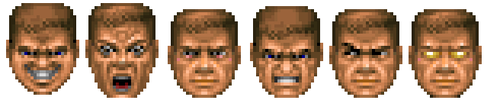

# React.js First Blood Kit



You need a first blood to killing spree.
Otherwords, this is how i start web projects.

### :wavy_dash: Stack :hocho: :baby_chick: :chicken: :two_men_holding_hands:
:small_orange_diamond: :feelsgood: :small_red_triangle: React<br />
:small_orange_diamond: :finnadie: :small_red_triangle_down: React router<br />
:small_orange_diamond: :rage4: :small_red_triangle: Styled components<br />
:small_orange_diamond: :goberserk: :small_red_triangle_down: Redux<br />
:small_orange_diamond: :rage2: :small_red_triangle: Reduxsauce<br />
:small_orange_diamond: :rage1: :small_red_triangle_down: Seamless immutable<br />
:small_orange_diamond: :hurtrealbad: :small_red_triangle: Redux persist<br />
:small_orange_diamond: :godmode: :small_red_triangle_down: Redux saga<br />
:small_orange_diamond: :rage3: :small_red_triangle: Apisauce<br />
:small_orange_diamond: :goberserk: :small_red_triangle_down: Reselect<br />
:small_orange_diamond: :finnadie: :small_red_triangle: Ramda<br />
:small_orange_diamond: :suspect: :small_red_triangle: Anime.js<br />
:small_orange_diamond: :goberserk: :small_red_triangle_down: ESLint<br />
:small_orange_diamond: :godmode: :small_red_triangle: Standard codestyle<br >

## :wavy_dash: Usage :gun: :bath: :smoking: :point_down:

```bash
 $ git clone  https://github.com/andreystarkov/react-first-blood ./ProjectName
 $ cd ./ProjectName
 $ chmod +X ./*.sh
 $ npm i
 $ npm start
```

## :wavy_dash: Build :bomb: :santa: :fork_and_knife: :money_with_wings:

```bash
 $ npm run build
```

## :wavy_dash: Tools :nose: :electric_plug: :eggplant: :hammer:

#### :small_blue_diamond: Create a new empty, [export ready](https://github.com/andreystarkov/create-index-exports) component:
```bash
 $ ./component.sh SomeComponent
```
Now you can use it from anywhere, like:
```js
  import { SomeComponent } from 'Components'
```

#### :small_blue_diamond: Create an empty top-level route
With redux/router connected
```bash
  ./screen.sh SomeScreen
```

## :wavy_dash: TODO :poop: :point_up: :point_up_2: :weary:
- [x] Base architechture
- [x] Base tools
- [ ] Reselect example
- [ ] Example of complex sagas/stores structure
- [ ] Tools for creating stores, sagas
- [ ] Interactive tools with options
- [ ] GraphQL things (Apollo)
- [ ] SVG Animation utils
- [ ] Prettier?

:cop:

